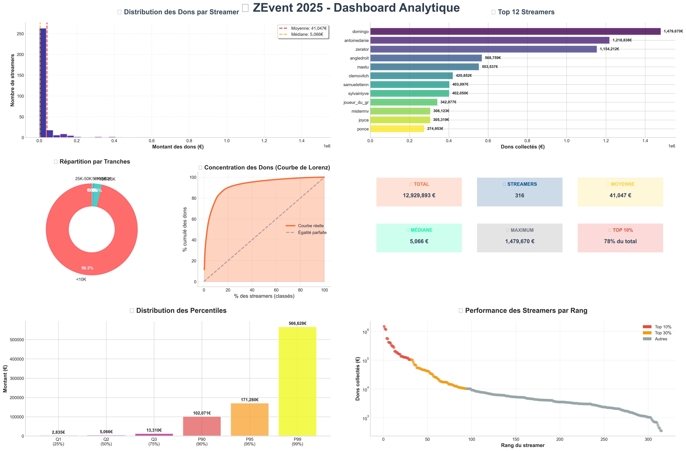

# ZEvent 2025 - Data Analysis



Analyse complète des données ZEvent 2025, l'événement caritatif français qui a réuni des streamers pour lever des fonds.

## 🎯 Objectif

Analyser les données de ZEvent 2025 pour comprendre les patterns de donations, les performances des streamers et les tendances de l'événement.

## 🚀 Installation

```bash
# Cloner le repo
git clone https://github.com/votre-username/ZEvent2025_data_analyse.git
cd ZEvent2025_data_analyse

# Créer un environnement virtuel
python -m venv .venv
.venv\Scripts\activate  # Windows
source .venv/bin/activate  # Linux/Mac

# Installer les dépendances
pip install -r requirements.txt
```

## 📝 Utilisation

```bash
# Lancer Jupyter Notebook
jupyter notebook
```

Puis ouvrez les notebooks dans l'ordre suivant :
1. `01_data_preparation.ipynb` - Préparation des données
2. `02_analysis.ipynb` - Analyse des données
3. `03_visualizations.ipynb` - Visualisations
4. `04_ZEvent_analysis.ipynb` - Analyse complète

## 🏗️ Structure

```
ZEvent2025_data_analyse/
├── data/
│   ├── raw/           # Données brutes (API ZEvent, SullyGnome CSV)
│   └── clean/         # Données nettoyées et prêtes pour analyse
├── notebooks/
│   ├── 01_data_preparation.ipynb    # Extraction et nettoyage
│   ├── 02_analysis.ipynb            # Analyses statistiques
│   └── 03_visualizations.ipynb      # Graphiques et rapports
├── outputs/           # Résultats et visualisations
└── requirements.txt
```

## 📊 Données

### Core Datasets (CSV)
| File | Description | Records | Source |
|------|-------------|---------|--------|
| `streamers_data.csv` | Basic streamer profiles | 326 | ZEvent API |
| `streamers_detailed_stats.csv` | Enhanced metrics | 319 | Cache API |
| `donations_evolution.csv` | Temporal donations | Time series | Cache API |
| `viewers_evolution.csv` | Temporal viewership | Time series | Cache API |
| `donation_goals.csv` | Individual objectives | Variable | ZEvent API |
| `event_schedule.csv` | Event programming | Variable | ZEvent API |

### Metadata Files (JSON)
| File | Description | Format |
|------|-------------|--------|
| `all_statistics.json` | Global event statistics | JSON |
| `individual_streamer_stats.json` | Raw individual stats | JSON |
| `donation_goals.json` | Raw donation goals | JSON |
| `event_schedule.json` | Raw event schedule | JSON |

## 🔢 Key Metrics

- **Total Donations**: €16,182,382.43
- **Event Duration**: 152.6 hours
- **Streamers**: 326 total, 319 with complete data
- **Period**: September 5-7, 2025
- **Data Quality**: 97.9% completion rate

## 🚀 Utilisation

1. **Installation**
   ```bash
   pip install -r requirements.txt
   ```

2. **Analyse complète**
   - Lancer `01_data_preparation.ipynb` pour préparer les données
   - Lancer `02_analysis.ipynb` pour l'analyse statistique
   - Lancer `03_visualizations.ipynb` pour les graphiques

## 📈 Résultats

Les notebooks génèrent :
- Statistiques descriptives complètes
- Analyses de corrélations
- Visualisations interactives
- Rapports exports-ready

## � Sources

- **API ZEvent** : zevent-api.gdoc.fr
- **SullyGnome** : Métriques Twitch complémentaires

## 📝 Notes

Projet simplifié pour une analyse efficace et directe des données ZEvent 2025.
1. **Data Extraction**: Execute notebooks in `01_data_extraction/`
2. **Data Processing**: Run processing notebooks in `02_data_processing/`
3. **Analysis**: Explore insights in `03_exploratory_analysis/`

### Key Notebooks
- `01_data_extraction/zevent_complete_scraping.ipynb` - Complete data extraction pipeline
- `03_exploratory_analysis/streamers_analysis.ipynb` - Streamer performance analysis
- `03_exploratory_analysis/temporal_patterns.ipynb` - Time series analysis

## 📈 Available Analyses

### 🎪 Streamer Performance
- Donation efficiency and audience engagement
- Top performers and growth patterns
- Individual vs collaborative performance

### ⏰ Temporal Patterns
- Peak donation and viewing hours
- Event impact on engagement
- Circadian patterns and weekend effects

### 🎯 Goal Achievement
- Donation objective analysis
- Success factors and strategies
- Gamification effectiveness

### 🎮 Event Coordination
- Scheduled activity impact
- Cross-streamer collaboration
- Programming optimization

## 🛠️ Technical Stack

- **Data Processing**: pandas, numpy
- **Visualization**: matplotlib, seaborn, plotly
- **Analysis**: scipy, scikit-learn
- **Web Scraping**: requests, BeautifulSoup
- **Notebooks**: Jupyter, ipywidgets

## 📊 Data Sources

- **ZEvent API** (`zevent-api.gdoc.fr`) - Official event data
- **GitHub Cache** (`maniarr.github.io/cache.zevent.gdoc.fr`) - Historical statistics
- **SullyGnome** (`sullygnome.com`) - Twitch analytics (optional)

## 🤝 Contributing

This project follows data science best practices:
- Modular and reusable code
- Comprehensive documentation
- Data quality validation
- Reproducible analysis pipeline

## 📄 License

This project is for educational and research purposes. All data is publicly available and used respectfully according to terms of service.

## 🎯 Next Steps

- [ ] Advanced ML modeling for donation prediction
- [ ] Real-time dashboard development
- [ ] Cross-year ZEvent comparison analysis
- [ ] Network analysis of streamer interactions

---

*Built with ❤️ for the ZEvent community and open-source data analysis*
